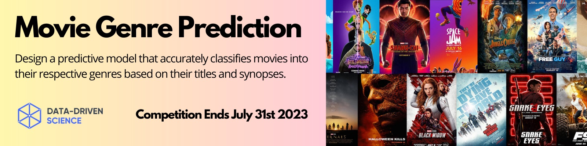

<h1 align='center'>Movie Genre Prediction - Huggingface Competition</h1>

<p align="center">

</p>

<p align="center">


</p>


## Introduction
In this competition hosted on Huggingface, I used my data science skills to design a predictive model that accurately classifies movies into their respective genres based on their titles and synopses. The challenge lies not just in achieving high accuracy, but also in ensuring that the model is efficient and interpretable.

**This is an Text Classification Competetion.**

📍 Find my score 0.4254 | Private Leaderboard [here](https://huggingface.co/spaces/competitions/movie-genre-prediction).


## Dataset

Participants will be provided with a comprehensive dataset comprising ~100,000 movies. Each entry includes the original title, the genre(s), and the synopsis of the movie.
The dataset contains a mix of both original and AI-generated titles, genres, and synopses to test the robustness of the models.
The 10 genres include action, adventure, crime, family, fantasy, horror, mystery, romance, scifi, and thriller.


## Evaluation Metric
The primary evaluation metric will be accuracy. Teams are encouraged to strive for a balance between accuracy, efficiency, and interpretability.

## Training the Model

Steps to train and validate the model are as follows:

### 1. Download the data from Huggingface

Start by downloading the data from [here](https://huggingface.co/spaces/competitions/movie-genre-prediction). 

Then unzip the file and extract it into a new folder: `input/`.


### 2. Installing the dependencies

I have utilized plenty of libraries here which can easily been installed using the following command.

```shell
$ pip install -r requirements.txt
```

### 3. Training the Model

Finally run the `TextClassificationBERT.ipynb` file and the training and validation should begin.


## Submission
after develop the models, submit your predictions in a CSV format like `submission.csv` file.
The CSV file should contain two columns, one for the sample ID and the other for the predicted genre.

**Please Star ⭐ this repository if you find it insightful!!**